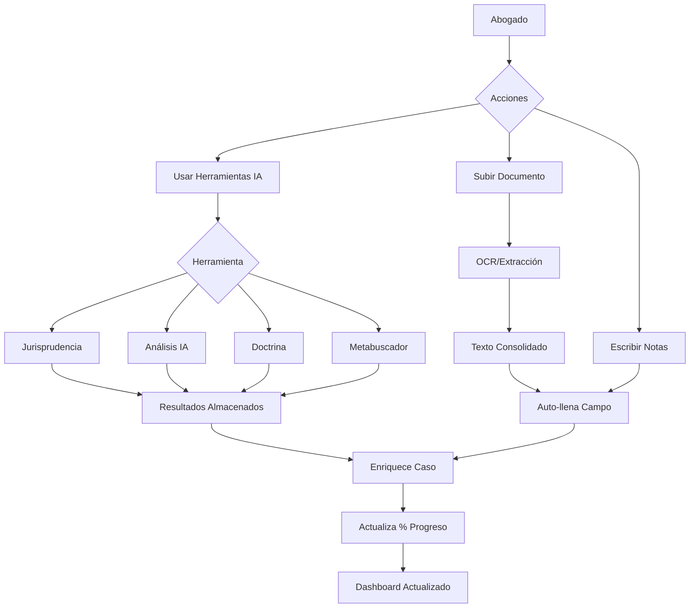

# 📊 Flujo Central de Gestión de Casos - Dr. Juro

## 🎯 Visión General

Dr. Juro implementa un **sistema de gestión de casos legales por fases** que acompaña al abogado desde el primer contacto con el cliente hasta el cierre del caso. El sistema se alimenta continuamente de:
- 📄 Documentos subidos (PDFs, imágenes, textos)
- 🔍 Investigaciones con herramientas de IA
- 📝 Notas y búsquedas realizadas
- ⚖️ Jurisprudencia consultada
- 📚 Doctrina referenciada

---

## 🏗️ Arquitectura Actual del Sistema

### 1. **Estructura de Fases del Proceso**

El caso avanza por **5 fases principales**, cada una con un porcentaje de completitud que refleja el progreso:

```
┌─────────────────────────────────────────────────────────────────┐
│  FASE 0: Registro de Cliente (0-10%)                           │
│  ├─ Datos básicos: nombre, teléfono, email                     │
│  ├─ Descripción inicial del caso                               │
│  └─ Crea el registro del cliente en la BD                      │
├─────────────────────────────────────────────────────────────────┤
│  FASE 1: Avance de Investigación (10-35%)                      │
│  ├─ Notificaciones oficiales                                   │
│  ├─ Denuncia policial                                          │
│  ├─ Documentos adicionales                                     │
│  ├─ 📁 Carpetas con transcripción automática (OCR con Gemini) │
│  └─ Campos se auto-llenan con texto consolidado de documentos  │
├─────────────────────────────────────────────────────────────────┤
│  FASE 2: Programar Cita (35-60%)                               │
│  ├─ Fecha y hora de reunión                                    │
│  ├─ Agenda de temas                                            │
│  └─ Notas de preparación                                       │
├─────────────────────────────────────────────────────────────────┤
│  FASE 3: Armar Estrategia (60-85%)                             │
│  ├─ Entender los hechos (análisis cronológico)                 │
│  ├─ Teoría del caso                                            │
│  ├─ Objetivos del cliente                                      │
│  ├─ Fundamento legal                                           │
│  ├─ Estrategia de defensa/acción                               │
│  └─ Riesgos y contingencias                                    │
├─────────────────────────────────────────────────────────────────┤
│  FASE 4: Seguimiento (85-100%)                                 │
│  ├─ Estado actual del caso                                     │
│  ├─ Última actualización                                       │
│  ├─ Próxima audiencia                                          │
│  ├─ Resoluciones emitidas                                      │
│  ├─ Tareas pendientes                                          │
│  └─ Observaciones                                              │
└─────────────────────────────────────────────────────────────────┘
```

### 2. **Sistema de Carpetas y Documentos**

Cada fase tiene **carpetas específicas** donde se almacenan documentos:

```typescript
FASE "avance_investigacion" tiene:
├─ denuncias/               (Denuncias policiales)
├─ notificaciones/          (Notificaciones oficiales)
├─ documentos_adicionales/  (Otros documentos)
├─ testimonios/             (Declaraciones)
└─ evidencia_fotografica/   (Fotos, capturas)

FASE "programar_cita" tiene:
├─ agenda/                  (Agenda de reunión)
├─ materiales/              (Materiales para la cita)
├─ acuerdos/                (Acuerdos previos)
└─ documentos_revision/     (Docs para revisar con cliente)

FASE "armar_estrategia" tiene:
├─ investigacion/           (Investigación legal)
├─ precedentes/             (Jurisprudencia encontrada)
├─ evidencias/              (Evidencias del caso)
├─ analisis/                (Análisis legal)
└─ estrategia/              (Estrategia definida)

FASE "seguimiento" tiene:
├─ actuaciones/             (Actuaciones procesales)
├─ resoluciones/            (Resoluciones judiciales)
├─ escritos/                (Escritos presentados)
├─ comunicaciones/          (Comunicaciones oficiales)
├─ seguimiento/             (Seguimiento general)
├─ resoluciones_emitidas/   (Resoluciones recibidas)
├─ tareas_pendientes/       (Tareas por hacer)
└─ observaciones/           (Notas y comentarios)
```

### 3. **Flujo de Alimentación de Información**



---

## 🔧 Cómo Funciona Actualmente

### **A. Carga de Documentos**

1. **Subida de archivo** (PDF, imagen, Word)
   ```typescript
   // Cliente sube documento a carpeta "denuncias"
   handleFileUpload(file, "denuncias") 
   ```

2. **Extracción automática de texto** (OCR con Gemini)
   ```typescript
   // Backend procesa con Gemini Vision API
   const response = await fetch("/api/extract-text", {
     method: "POST",
     body: formData
   });
   ```

3. **Consolidación automática**
   ```typescript
   // El sistema consolida TODO el texto de una carpeta
   useEffect(() => {
     // Cargar textos consolidados cuando se suben documentos
     loadConsolidatedTexts();
   }, [documentTrigger]);
   ```

4. **Auto-llenado de campos**
   ```typescript
   // El texto consolidado se inyecta en el campo correspondiente
   setFormData(prev => ({
     ...prev,
     [field.name]: data.consolidatedText
   }));
   ```

### **B. Uso de Herramientas de IA**

Cada campo tiene acceso a **4 herramientas**:

#### 1️⃣ **Jurisprudencia** 🏛️
- Busca precedentes relevantes
- Consulta criterios del Tribunal Constitucional
- Analiza sentencias vinculantes

```typescript
const handleSearch = (filters) => {
  jurisprudenceSearch.mutate({ query });
};
```

#### 2️⃣ **Análisis de Documentos** 🤖
- Extrae conceptos legales clave
- Identifica áreas del derecho
- Lista artículos relevantes
- Detecta riesgos
- Genera recomendaciones

```typescript
const analysis = await fetch('/api/analyze-document', {
  method: 'POST',
  body: formData
});
```

#### 3️⃣ **Doctrina** 📚
- Busca en repositorios académicos
- Referencias de libros y artículos
- Citas de autores

```typescript
const response = await fetch(`/api/doctrinas?search=${query}`);
```

#### 4️⃣ **Metabuscador** 🌐
- Busca en PUCP, UNMSM, Tribunal Constitucional
- Fuentes externas verificadas
- Links directos a recursos

```typescript
const response = await fetch('/api/metabuscador/buscar', {
  method: 'POST',
  body: JSON.stringify({ termino })
});
```

#### **Almacenamiento de Resultados** 💾

Los resultados se **guardan en memoria local** por campo y documento:

```typescript
const storedResults = {
  field: {
    "field:entenderHechos": {
      jurisprudencia: {...},
      analisis: {...},
      doctrina: {...}
    }
  },
  document: {
    "document:doc-123": {
      analisis: {...},
      metabuscador: {...}
    }
  }
};
```

### **C. Cálculo de Progreso**

El sistema calcula el progreso automáticamente:

```typescript
const calculateCompletionForPhase = (phase, data, previous) => {
  const required = PHASE_REQUIRED_FIELDS[phase];
  const isComplete = required.every(field => 
    hasFilledValue(data[field])
  );
  
  if (isComplete) {
    return Math.max(previous, PHASE_COMPLETION_TARGETS[phase]);
  }
  return previous;
};

// Objetivos por fase
PHASE_COMPLETION_TARGETS = {
  registro: 10,
  avance_investigacion: 35,
  armar_estrategia: 60,
  programar_cita: 85,
  seguimiento: 100
};
```

### **D. Persistencia en Base de Datos**

Todo se guarda automáticamente:

```typescript
// Auto-guardar cada 3 segundos
useEffect(() => {
  const timeoutId = setTimeout(() => {
    saveProcessToDB(processState);
  }, 3000);
  return () => clearTimeout(timeoutId);
}, [processState]);
```

```sql
-- Tabla principal
CREATE TABLE case_process_states (
  case_id UUID PRIMARY KEY,
  current_phase VARCHAR(50),
  completion_percentage VARCHAR(10),
  client_info JSONB,
  investigation_progress JSONB,
  case_strategy JSONB,
  client_meeting JSONB,
  follow_up JSONB,
  updated_at TIMESTAMP
);

-- Tabla de documentos
CREATE TABLE case_documents (
  id UUID PRIMARY KEY,
  case_id UUID REFERENCES cases(id),
  filename VARCHAR(500),
  file_type VARCHAR(100),
  category VARCHAR(50),
  content TEXT,
  notes TEXT,
  upload_date TIMESTAMP
);
```

---

## 🚀 Mejoras Propuestas

### **1. Sistema de Notas Vinculadas**

Cada búsqueda o resultado de herramienta debería poder guardarse como **nota vinculada**:

```typescript
interface CaseNote {
  id: string;
  caseId: string;
  phase: string;
  field?: string;
  documentId?: string;
  toolType: 'jurisprudencia' | 'analisis' | 'doctrina' | 'metabuscador';
  content: any;
  excerpt?: string;
  createdAt: Date;
  tags: string[];
}
```

**Beneficio**: El abogado puede revisitar todas las búsquedas e investigaciones realizadas.

### **2. Timeline de Progreso del Caso**

Mostrar una línea de tiempo visual:

```
📅 12/Nov/2025 10:30 - Cliente registrado: Juan Pérez
📄 12/Nov/2025 11:15 - Subido: denuncia_policial.pdf
🔍 12/Nov/2025 11:20 - Búsqueda jurisprudencia: "responsabilidad civil"
📝 12/Nov/2025 14:00 - Fase completada: Investigación (35%)
⚖️ 13/Nov/2025 09:00 - Análisis IA generado: teoría del caso
✅ 13/Nov/2025 10:30 - Cita programada: 15/Nov/2025
```

### **3. Dashboard de Caso Individualizado**

Vista centralizada por caso con:
- 📊 Progreso visual (gráfico circular)
- 📁 Documentos clave (últimos 5)
- 🔍 Búsquedas recientes
- ⏰ Próximos eventos
- ⚠️ Tareas pendientes
- 📈 Actividad reciente

### **4. Sistema de Tags y Categorización**

```typescript
interface CaseTag {
  name: string;
  color: string;
  category: 'urgente' | 'tipo-caso' | 'tema-legal' | 'estado';
}

// Ejemplo:
tags: [
  { name: 'Laboral', color: 'blue', category: 'tipo-caso' },
  { name: 'Despido arbitrario', color: 'red', category: 'tema-legal' },
  { name: 'Urgente', color: 'orange', category: 'urgente' }
]
```

### **5. Exportación Completa del Expediente**

Generar un **reporte PDF integral** con:
- Resumen ejecutivo
- Cronología del caso
- Documentos anexos
- Análisis de IA realizados
- Jurisprudencia consultada
- Estrategia legal
- Timeline de eventos
- Próximos pasos

### **6. Sistema de Alertas y Recordatorios**

```typescript
interface CaseAlert {
  caseId: string;
  type: 'audiencia' | 'plazo' | 'documento-pendiente' | 'seguimiento';
  dueDate: Date;
  priority: 'alta' | 'media' | 'baja';
  message: string;
  resolved: boolean;
}
```

### **7. Búsqueda Global en Casos**

Buscar en TODO el contenido de un caso:
- Textos de documentos
- Notas del abogado
- Resultados de herramientas
- Estrategias definidas

```typescript
const searchInCase = (caseId: string, query: string) => {
  // Busca en todos los campos, documentos y notas
  return {
    documents: [...matches],
    notes: [...matches],
    toolResults: [...matches],
    fields: [...matches]
  };
};
```

---

## 📋 Checklist de Implementación

### ✅ Ya Implementado
- [x] Sistema de fases (5 etapas)
- [x] Carpetas por fase con categorías
- [x] Carga de documentos con OCR
- [x] Consolidación automática de textos
- [x] 4 herramientas de IA integradas
- [x] Almacenamiento de resultados por campo/documento
- [x] Cálculo automático de progreso
- [x] Auto-guardado cada 3 segundos
- [x] Edición de datos del cliente en cualquier momento
- [x] Sistema de transcripción de documentos en 2 etapas
- [x] Notas y anotaciones por documento

### 🔄 En Mejora
- [ ] Sistema de notas vinculadas persistente
- [ ] Timeline visual de progreso
- [ ] Dashboard individualizado por caso
- [ ] Sistema de tags
- [ ] Exportación PDF completa
- [ ] Alertas y recordatorios
- [ ] Búsqueda global en caso
- [ ] Vinculación entre casos relacionados
- [ ] Plantillas de estrategia por tipo de caso
- [ ] Integración con calendario del abogado

---

## 💡 Flujo Ideal del Abogado

### **Día 1: Primer Contacto**
1. Recibe llamada/email del cliente
2. Abre Dr. Juro → "Nuevo Caso"
3. Registra datos básicos (Fase 0 - 10%)
4. Cliente le envía WhatsApp con fotos de documentos
5. Carga fotos en carpeta "notificaciones"
6. Sistema extrae texto automáticamente
7. Usa herramienta "Análisis IA" para primera evaluación

### **Día 2-3: Investigación**
1. Sube denuncia policial (PDF)
2. Sistema la transcribe y consolida
3. Campo "Denuncia Policial" se auto-llena
4. Usa herramienta "Jurisprudencia" en el texto consolidado
5. Resultados quedan guardados y linkados
6. Usa "Metabuscador" para buscar artículos PUCP
7. Agrega notas: "Encontré precedente TC sobre despido"
8. Completa fase → Progreso sube a 35%

### **Día 4: Preparación de Reunión**
1. Programa cita para el viernes
2. Revisa todo lo recopilado
3. Usa "Análisis IA" en campo "Entender Hechos"
4. IA le sugiere teoría del caso
5. Anota objetivos del cliente
6. Define estrategia legal con ayuda de "Doctrina"
7. Completa estrategia → Progreso 60%

### **Día 5: Reunión con Cliente**
1. Revisa Dashboard del caso antes de reunión
2. Ve timeline de todo lo investigado
3. Presenta estrategia al cliente
4. Cliente aprueba y firma contrato
5. Registra notas de la reunión
6. Progreso → 85%

### **Semanas siguientes: Seguimiento**
1. Registra cada actuación procesal
2. Sube resoluciones judicales
3. Anota próximas audiencias
4. Actualiza tareas pendientes
5. Sistema le alerta de plazos
6. Caso avanza → 100% cuando se resuelve

---

## 🎯 Conclusión

Dr. Juro implementa un **sistema completo de gestión de casos** donde:

✅ **El caso es el centro**: Todo gira alrededor del expediente
✅ **Alimentación continua**: Cada documento, búsqueda y nota enriquece el caso
✅ **IA como asistente**: 4 herramientas potencian la investigación legal
✅ **Progreso visible**: El abogado siempre sabe en qué etapa está
✅ **Auto-guardado**: Nada se pierde
✅ **Escalable**: Preparado para agregar más herramientas y features

El objetivo es que el abogado **nunca pierda información** y tenga **todo el contexto necesario** en cada momento del proceso legal.
